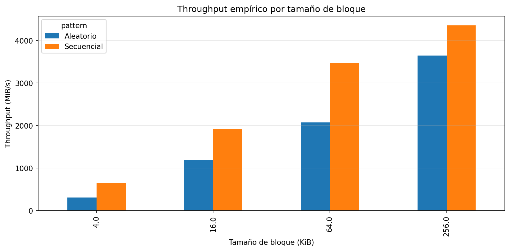
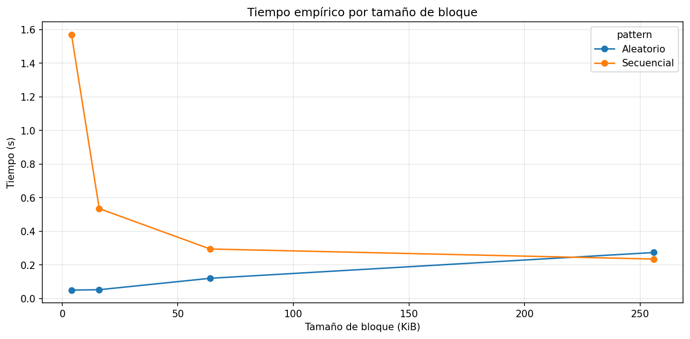
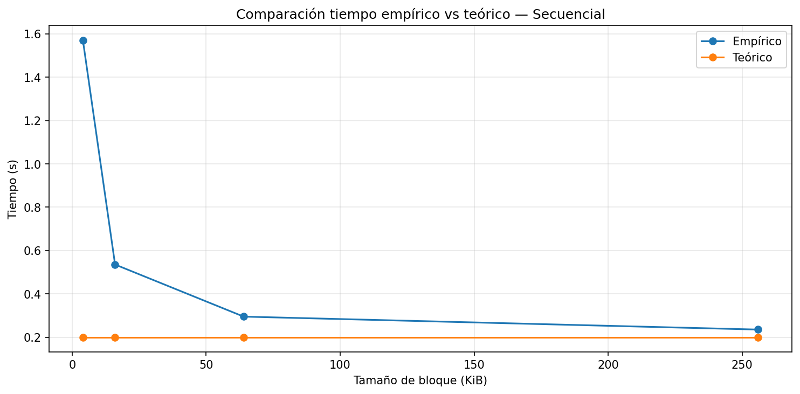
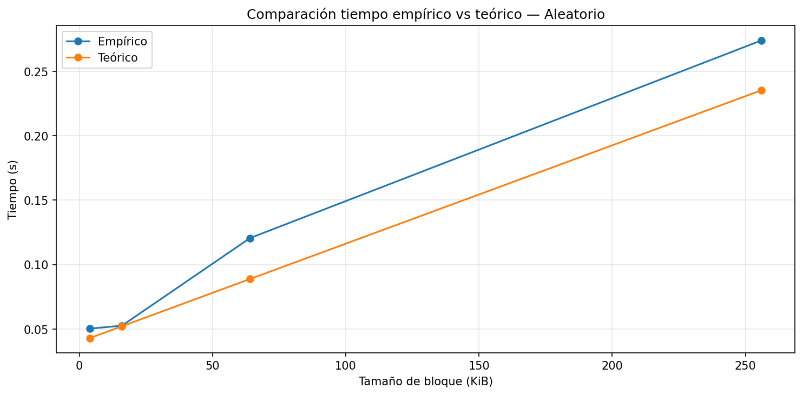
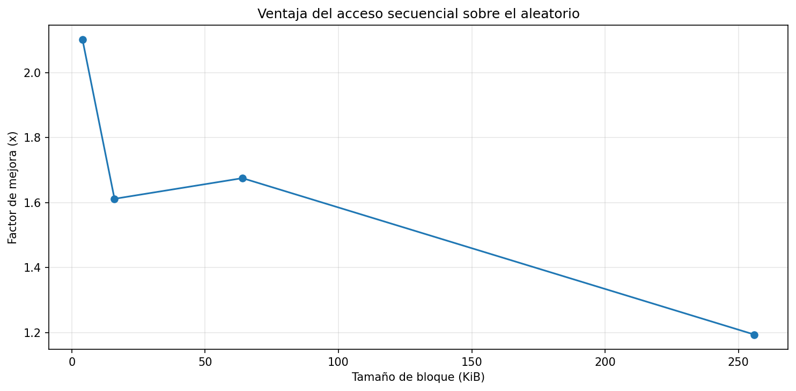

# Laboratorio — Almacenamiento en disco y desempeño de I/O

## Caracterización del equipo

| Parámetro | Valor |
|----------|------|
| Sistema Operativo | Windows 11 |
| CPU | AMD Ryzen 5 6600H @ 3.30 GHz |
| Arquitectura | x64 / 6 núcleos |
| RAM | 16 GB |
| Disco | SSD NVMe |
| Carga de CPU en reposo | 4%-7% |

## Descripcion
En este laboratorio se midio el rendimiento del acceso al disco, comparando el acceso secuencial con el aleatorio, todo esto probando diferentes tamaños de bloque, tambien se analizaron tiempos de ejecucion, throughputs y graficas, 

## Resultados resumidos

| Tamaño de bloque (KiB) | Tiempo secuencial (s) | Tiempo aleatorio (s) | Throughput secuencial (MiB/s) | Throughput aleatorio (MiB/s) | Speedup |
|------------------------|----------------------|----------------------|-------------------------------|-------------------------------|---------|
| 4                      | 1.5699               | 0.0503               | 652.26                        | 310.42                        | 2.10    |
| 16                     | 0.5352               | 0.0526               | 1913.20                       | 1187.26                       | 1.61    |
| 64                     | 0.2948               | 0.1205               | 3473.73                       | 2073.84                       | 1.68    |
| 256                    | 0.2350               | 0.2740               | 4356.81                       | 3649.77                       | 1.19    |

Se observa que el acceso secuencial presenta mayor throughput en todos los casos y el mayor speedup se obtuvo en bloques de 4 KiB con un valor de 2.1.

---

## Gráficas

### Throughput

### Tiempo

### Comparación teórica vs empírica
  

### Speedup

---

## Preguntas de cierre

### 1. Comparación de patrones
El acceso secuencial fue aproximadamente hasta 2.1 veces más rápido que el acceso aleatorio en bloques de 4 KiB. Este resultado coincide con la teoría, ya que el acceso secuencial reduce la cantidad de accesos al disco, disminuyendo el impacto de la latencia

### 2. Efecto del tamaño de bloque
El throughput del acceso aleatorio aumentó a medida que creció el tamaño del bloque, esto sucede porque se transfiere más información por cada acceso, reduciendo el impacto relativo de la latencia

### 3. Teoría vs práctica
El modelo teórico y los resultados reales no coincidieron del todo, especialmente en bloques pequeños. Por ejemplo, con bloques de 4 KiB el modelo estimaba un tiempo de 0.20 s pero en la práctica fue de 1.57 s.
Esto pasa porque el modelo asume condiciones perfectas que en la realidad no existen, como que no hay otros procesos corriendo, que la caché no interfiere, o que el disco responde siempre igual, en la práctica el sistema operativo, la carga del CPU y el propio disco introducen variaciones que el modelo no puede predecir, a medida que los bloques fueron más grandes, los valores se fueron acercando más a la teoría

### 4. Tipo de disco
Aunque un SSD no es como un disco mecanico HDD, el acceso aleatorio no es la mejor opcion, todo esto ocurre porque cuando se hacen lecturas pequeñas en posiciones distintas, el controlador del SSD tiene que hace mucho mas trabajo para ubicar y entregar cada dato, encambio con el acceso secuencial los datos llegan de forma ordenada, y por lo tanto el controlador puede trabajar de forma mas fluida y eficiente, todo esto se vio en practica en el laboratorio realizado

### 5. Aplicación práctica
Ahora bien, en base a lo aplicado y obtenido en el laboratorio, si se diseñara un motor de BD lo mas inteligente e importante seria organizar los datos de forma que se puedan leer de forma continua, y no aleatoria, todo esto con el fin de aprovechar al maximo la velocidad de lectura del disco, usando la busqueda secuencial , que como se pudo ver en el experimento puede llegar a ser hasta el doble

---

## Conclusión

En conclusion en este laboratorio se pudo observar de que la informacion en un disco se almacena en bloques, y esto importa debido a que el sistema lee los datos completos y no bytes individuales, lo que afecta directamente el rendimiento. Ahora bien mirando los resultados obtenidos apartir de un disco SSD NVMe, se evidencio que el acceso secuencial es superior al aleatorio en todos los bloques testeados, se tienen comportamientos muy distintos

En los resultados obtenidos podemos ver que el acceso secuencial alcanzo un throughput de 4356.812751	MiB/s en el bloque mas grande que es el de 256Kb, mientras que el aleatorio llego hasta 3649.770905 MibB/s, y el mayor factor de mejora respecto el secuencial al aleatorio fue en el bloque de 4Kb con una mejora de 2.1, lo que podemos ver el mejor rendimiento de el acceso secuencial sobre el aleatorio

Ahora bien, el modelo teorico tuvo sus pequeños errores porque idealizaba todo no tenia encuenta factores externos, por lo que sobre todo en el tiempo fue bastante diferente, subestimo el tiempo de ejecucion empirico, el tiempo teorico que daba el modelo era de 0.20s aproximadamente en un bloque de 4Kb, pero a la hora de la verdad fue otra, me dio un valor de 1.52s en realidad, por lo que si comparamos valores, estos son muy diferentes, pero a medida del aumento del tamaño de bloques la verdad si se acerco el tiempo de ejecucion en ambos accesos como pudimos ver en las graficas anteriores
 
Ya para finalizar, en base a resultados el diseño de un sistema deberia centrarse en el uso de accesos secuenciales, siempre y cuando sea posible, ya que esto permite un mejor rendimiento, y aunque el tiempo de accesos no sea el mejor lo compensa el throughput
